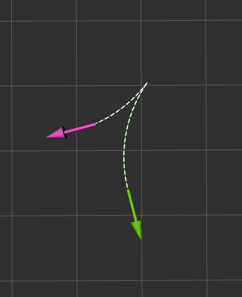

# ompl ReedsSheppCurve rviz   
creating a Reeds-Shepp curve with ompl  
set start and end pose with rviz  
show result in path and marker array  

## how to run  
```
roscore
rosrun omplrscurve omplrscurve
roscd omplrscurve/rviz
rviz -d myrviz.rviz
```
set Start pose with 2D Pose Estimate  
set End pose with 2D Nav Goal  
   

## Dependencies  
ubuntu 18.04, ROS1 melodic  
```
sudo apt install libompl-dev  
```

## result  
   
   
